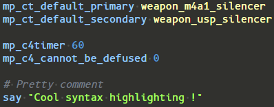
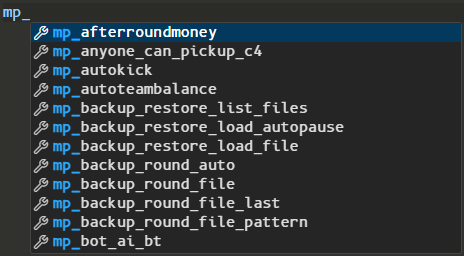
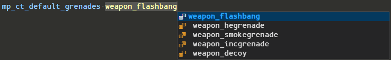
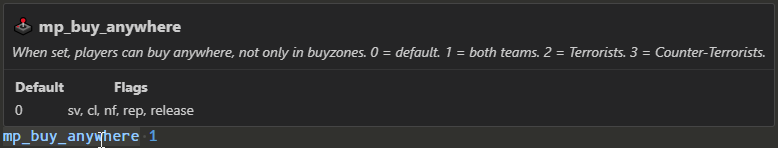

# Counter Strike CFG IntelliSense

The Counter Strike CFG IntelliSense plugin for Visual Studio Code provides a support for Counter Strike configuration files *(.cfg)*. With features like syntax highlighting, auto-completion, and integrated documentation.

## Features

- **Syntax Highlighting**: Easily identify different elements in your CFG files with syntax highlighting.

 
*syntax highlight for commands, integers, strings and weapons*

- **Auto-completion**: Save time and reduce errors with intelligent auto-completion, suggesting commands and settings based on context.

 
*Auto-complete commands*

 
*Auto-complete value on specific commands*

- **Integrated Documentation**: Access to offical documentation for each command.

 
*Official documentation for each command*

## Feedback

We welcome your feedback and suggestions to improve the Counter Strike CFG IntelliSense plugin. Feel free to [report issues](https://github.com/example/counter-strike-cfg-intellisense/issues) or [contribute to the project](https://github.com/Trobibot/counter-strike-cfg-docmentation-and-highlight).

## About

Counter Strike CFG IntelliSense is developed and maintained by [Trobibot](https://github.com/Trobibot). 
Special thanks to [Tanguy](https://github.com/Tanguy-L)